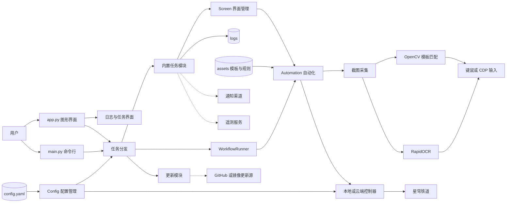

# March7thAssistant 项目结构与学习指南

> 目标：理解项目从启动、任务调度，到识别游戏画面、执行操作、写日志和发送通知的完整链路。

## 1. 项目定位

March7thAssistant 是一个面向《崩坏：星穹铁道》的 Windows 自动化桌面应用。它既提供图形界面，也提供命令行入口；核心做法是捕获游戏画面，通过模板匹配或 OCR 判断状态，再执行键鼠或云游戏浏览器输入。

它是一个单体 Python 应用，而不是 Web 服务：大部分功能都在同一进程体系内，由 `app.py`、`main.py`、`app/`、`tasks/` 与 `module/` 协作完成。

## 2. 架构图

当前可编辑的 FigJam 架构图：<https://www.figma.com/board/vZAU5wv0GXaEE7XyOiMxUj>

下图是文档内可渲染的结构图。后续生成的 `gpt-image-2` PNG 图会放在 `output/imagegen/march7thassistant-architecture.png` 并替换到本节。



## 3. 目录地图

| 路径 | 职责 | 建议优先级 |
| --- | --- | --- |
| `app.py` | GUI 启动、管理员权限、单实例、Qt 应用与主窗口创建。 | 高 |
| `main.py` | CLI 参数解析、任务分发、异常处理、资源清理。 | 高 |
| `app/` | 图形界面页面：主页、设置、日志、工具、流程编辑器、抽卡记录等。 | 中 |
| `tasks/` | 具体业务任务：日常、清体力、周常、挑战、奖励、活动和工具。 | 高 |
| `module/` | 跨任务复用的底层能力：配置、游戏、自动化、OCR、工作流、更新、通知。 | 高 |
| `assets/` | 模板图片、默认配置、OCR 替换规则、UI 素材、示例工作流。 | 中 |
| `config.yaml` | 用户当前配置；首次运行会由默认配置生成或合并。 | 高 |
| `config/` | 用户工作流及其模板、OCR 资源。 | 中 |
| `logs/` | 执行日志与故障排查信息。 | 中 |
| `3rdparty/` | 模拟宇宙与锄大地相关的 Git 子模块。 | 后期 |

## 4. 两个入口

### 图形界面入口：`app.py`

1. 将工作目录切到项目目录，并解析命令行参数。
2. 在 Windows 上请求管理员权限；这是为了前台切换、模拟输入和系统级操作。
3. 初始化 PySide6 与 QFluentWidgets，建立单实例本地 Socket。
4. 加载语言和配置，创建 `app.main_window.MainWindow`。
5. 用户在界面点击任务后，日志页面使用 `QProcess` 管理任务进程并展示输出。

### 命令行入口：`main.py`

1. 解析任务名，例如 `daily`、`power`、`universe`。
2. 初始化配置、日志、通知、OCR 与遥测。
3. 选择“完整运行”、单个内置任务、更新任务，或 YAML 自定义工作流。
4. 无异常时执行收尾；发生异常时保存错误截图、写日志并按配置通知。

## 5. 主要功能流程

### 内置任务流程

```text
启动任务
  → 读取配置
  → 启动或切换游戏
  → 截图并识别当前界面
  → 执行任务逻辑
  → 发送通知、写日志、清理 OCR
```

`main.py` 的“完整运行”会依次执行：版本检查 → 启动游戏 → 日常任务 → 奖励领取 → 收尾。单项任务则由任务名分派到对应模块。

### 视觉识别和自动化闭环

1. `module/automation/screenshot.py` 从本地游戏窗口或云游戏浏览器获取截图。
2. `module/automation/automation.py` 调用 OpenCV 做模板匹配，或调用 OCR 读取文字。
3. `module/screen/screen.py` 根据 `assets` 中的界面配置判断当前页面，并决定如何切换。
4. `module/game/` 根据配置选用本地控制器或云游戏控制器。
5. 输入层通过 PyAutoGUI 模拟键鼠，云游戏场景则可以走 CDP 输入。

### 自定义工作流

`module/workflow/__init__.py` 将 YAML 步骤解释为动作。支持图片点击、文字点击、坐标点击、图片或 OCR 判断、切换界面、按键、等待、条件、循环、通知和停止流程。工作流资源保存在 `config/workflows/`，示例资源在 `assets/config/workflows/`。

## 6. 核心模块说明

| 模块 | 关键职责 |
| --- | --- |
| `module/config/` | 合并默认 YAML 与用户配置；部分配置可由环境变量覆盖。 |
| `module/game/` | 管理本地/云游戏启动、窗口、输入后端及结束后的系统动作。 |
| `module/automation/` | 截图、模板定位、OCR 定位、点击、按键、调试叠加层。 |
| `module/screen/` | 识别游戏界面、维护页面状态并按定义切换页面。 |
| `module/ocr/` | 封装 RapidOCR，供任务和工作流识别文字。 |
| `module/notification/` | 适配 Windows 通知、Telegram、邮件、Webhook、企业微信等渠道。 |
| `module/update/` | 从 GitHub 或镜像检查版本、下载、校验、解压与更新。 |
| `module/telemetry/` | 记录启动、任务结果与错误事件。 |

## 7. 推荐阅读顺序

### 第 1 步：先看入口和调度

1. `app.py`：理解 GUI 如何创建、为何要求管理员权限、如何保证单实例。
2. `main.py`：理解命令行参数、任务映射和完整运行顺序。
3. `utils/tasks.py` 与 `app/log_interface.py`：理解 GUI 如何拉起和托管任务进程。

### 第 2 步：理解自动化引擎

4. `module/config/__init__.py` 与 `module/config/config.py`：确认配置从哪里来、如何保存。
5. `module/game/__init__.py`、`module/game/local.py`：理解本地/云游戏控制器的选择。
6. `module/automation/automation.py`：这是截图、查图、查字、点击等能力的核心。
7. `module/automation/screenshot.py`、`module/automation/local_input.py`：分别看画面如何取得、输入如何发出。
8. `module/screen/screen.py` 与 `module/ocr/ocr.py`：理解“看见什么页面”和“读到什么文字”。

### 第 3 步：选一个业务任务纵向跟读

9. 推荐从 `tasks/daily/daily.py` 开始：它接近完整运行中的日常流程。
10. 再读 `tasks/power/power.py`：理解体力任务与战斗任务的协作。
11. 最后看 `tasks/weekly/`、`tasks/challenge/`、`tasks/reward/`：它们是不同游戏内容的任务实现。

### 第 4 步：扩展能力

12. `module/workflow/__init__.py` 与 `app/workflow_interface.py`：学习可视化流程编辑和 YAML 执行器。
13. `module/notification/`：学习任务结果如何推送。
14. `module/update/`、`module/telemetry/`：最后再看更新、下载校验和遥测等辅助系统。

## 8. 初学时的阅读建议

- 不要一开始通读 `tasks/`；先沿着“入口 → 调度 → 自动化引擎 → 一个具体任务”追踪调用链。
- 遇到模板匹配失败时，先检查 `assets/` 中的图片、屏幕分辨率与日志，而不是先改任务逻辑。
- 修改配置时优先通过 GUI；直接改 `config.yaml` 前先备份。
- 调试任务时优先使用 `main.py -h`、`main.py -l` 和单项任务，不要直接运行完整自动化。
